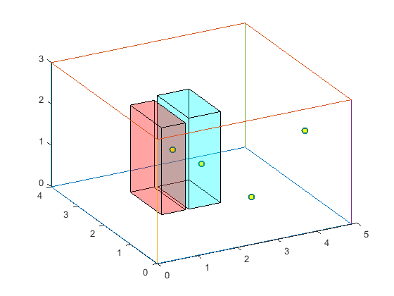

# ServerRoomCFD

## Source: Server room CFD analyses results 
- [Poznan Supercomputing and Networking Center](https://zenodo.org/record/3610078#.XlNpAigzaM8)

## Proceed by
  - Sangjun Son (2020/02/27)

## Description
- Modeled testbed included server room equipped with two heterogeneously occupied racks (with each server modeled separately) and one roof-mounted cooling device.
- Each rack has 8 and 6 active devices respectively.
- The dataset is every second measurement of temperature in 4 virtual probes, inlet/outlet of each server and air conditioner.
- Detailed numerics of the server room can be found in [link](https://zenodo.org/record/3610078#.XlNpAigzaM8) mentioned above.
- Brief diagram of server room (red: rack 1, blue: rack 2, dots: virtual probes)

## Data Statistics
### Overview
- \# of 1st scenarios (air conditioning temperature setup) : 3
- \# of 2nd scenarios (power usage variation) : 3
- \# of temperature probes : 34
- \# of measuring time (every 1s) : 4157

### Mode
- **ServerRoomCFD.tensor**: 4
  - Mode 1: air conditioning temperature setups (24, 27 and 30 Celsius degrees)
  - Mode 2: power usage (50%/75%/100% scenario)
  - Mode 3: temperature probes
  - Mode 4: duration time (3000~4000s)

Index of \<Probe> | Probe Location
--- | ---
1~2 | Inlet/Outlet of air conditioner
3~6 | Virtual probe located in `(1.8, 2.12, 1.42)`, `(4.8, 1.65, 1.5)`, `(2.5, 2.09, 0.95)`, `(2.8, 0.65, 0.75)`
7~22 | Inlet/Outlet surfaces (odd/even indices) of each server in rack 1
23~34 | Inlet/Outlet surfaces (odd/even indices) of each server in rack 2

### Format
- **ServerRoomCFD.tensor**: \<AirCon> \<Power> \<Probe> \<Time> (Temperature)
  - Temperature in absolute degrees.

### Dimension
- **ServerRoomCFD.tensor**: 3 * 3 * 34 * 4,157

### Nonzeros
- **ServerRoomCFD.tensor**: 1,009,426 (79.4%)
  - Length of time mode varies from scenario to scenario.

